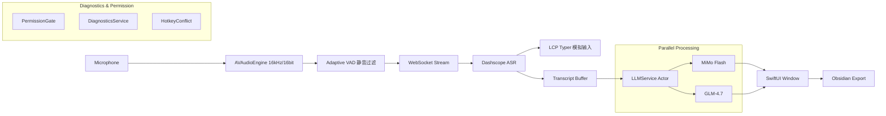

# FlashASR 6.5: Think Fast, Type Faster.

<div align="center">


**基于 Aliyun Dashscope 与双 AI 引擎的 macOS 原生语音转文字生产力神器**

[](https://www.apple.com/macos/)
[](https://swift.org)
[](LICENSE)
[](https://github.com/BRSAMAyu/flash_ASR/releases)

[**立即下载 (v6.5.0)**](https://github.com/BRSAMAyu/flash_ASR/releases/latest/download/FlashASR-6.5.0-macos.dmg) &nbsp;·&nbsp; [📖 更新日志](CHANGELOG.md) &nbsp;·&nbsp; [💬 提交反馈](https://github.com/BRSAMAyu/flash_ASR/issues)

</div>

---

## 🌟 为什么选择 FlashASR？

在 macOS 上，系统自带的听写往往不够智能，而网页版 ASR 又过于繁琐。**FlashASR** 填补了这一空白：它是一个常驻菜单栏的"透明"层，在你说话的同时，利用大模型的力量将破碎的口语实时锻造成精美的 Markdown 笔记。

### 🔄 独创「双引擎协同」架构 (Dual-Engine)
FlashASR 6.5 进一步强化了 AI 生成"等待感"与"深度感"的平衡：
- **MiMo Flash (主引擎)**: 毫秒级流式响应，像打字机一样跟随你的声音。
- **GLM-4.7 (深度引擎)**: 后台并行重构。当 MiMo 完成基础整理时，GLM-4 已经为你准备好了逻辑更严密的深度版本。
- **瞬时切换**: 通过录音浮窗或 Dashboard 控制台一键切换视图，对比不同 AI 的思考结果。

### ⌨️ LCP 增量模拟输入
独家实现的 **LCP (Longest Common Prefix)** 算法，让 FlashASR 在实时转写模式下能够智能地模拟退格与输入。当 ASR 引擎修正前面的词时，你的光标也会自动"回退"并重写，实现真正的"所说即所得"。

### 🧠 深度打磨的提示词工程 (Prompt Engineering)
内置三个等级的整理模式，采用 XML 标签化 Prompt 架构，精准识别口语噪声：
- **忠实级**: 仅做最小化排版，保留每一处语气细节。
- **轻润级**: 自动清理"那个"、"就是说"等废话，智能补齐残句。
- **深整级**: **逻辑重组**。将发散的对话转化为结构化的任务列表、SWOT 矩阵或步骤指南。

---

## 🚀 核心功能矩阵

### 1. 两种采集模式，适应全场景
- **实时流式 (⌥ + Space)**: 极速模式，适合发邮件、写代码注释或即时聊天。
- **文件闪传 (⌥ + ←)**: 默认 5 分钟（普通）/15 分钟（Markdown）/60 分钟（课堂），可在设置中分别调整，最长 3 小时。

### 2. 全能控制台 (Dashboard)
全新的可视化控制台，提供比菜单栏更强大的交互体验：
- **实时/文件双模式切换**: 无论是即兴口述还是录音整理，一站式搞定。
- **Markdown 实时预览**: 左侧编辑，右侧预览，支持撤回转写操作。
- **多级重构**: 对已有的文本进行"忠实"、"轻润"、"深整"的二次加工。

### 3. 录音指示器 (Recording Indicator)
一个优雅的、半透明的动态浮窗，提供实时音量波形反馈，并集成了：
- **实时切换**: 在不同 Markdown 等级间跳转。
- **Obsidian 联动**: 一键同步到你的第二大脑。
- **智能清理**: 自动跳过静音片段，节省 Token。

### 4. 智能运维体系
- **权限向导**: 交互式的权限检查页面，引导解决 macOS 复杂的输入监听与辅助功能授权问题。
- **冲突检测**: 设置快捷键时自动检测系统冲突，避免按键无效的困扰。
- **一键诊断**: 遇到问题？一键生成包含日志、配置和状态的诊断报告，方便排查。

### 5. 智能文本后处理
- **叠词保护**: 识别并移除 ASR 重复错误（如"但是但是"），同时智能保留中文合法叠词（如"考虑考虑"、"年年岁岁"）。
- **中英混排**: 自动在中文与英文/数字之间插入空格，追求极致的视觉舒适。

### 6. 多轮会话管理
- 支持在同一次会话中多次录音，自动累积整理。
- 提供"全文重排"功能，将多轮录音整合为一份完整的 Markdown 文档。
- 自动生成会话标题，方便回溯管理。

---

## 🛠 技术架构预览



---

## 🛡 隐私与安全

- **数据足迹**: 语音数据仅流向您配置的阿里云 API，不经过任何第三方中转服务器。
- **透明度**: 开源项目，您可以随时审计网络请求逻辑。
- **离线沙箱**: 所有的配置信息和会话历史均本地加密存储（或通过系统 Keychain）。

---

## 🏗 快速开始

### 1. 准备工作
前往 [阿里云 Dashscope](https://dashscope.console.aliyun.com/) 获取你的 API Key（新用户有丰厚的免费额度）。

### 2. 安装
下载 DMG 文件，拖入应用目录，点击启动。

### 3. 授权 (全新引导)
FlashASR 6.5 引入并持续优化了 **Permission Gate**，会引导您逐步开启以下权限：
- **麦克风**: 采集声音。
- **辅助功能**: 将文字模拟键入到其他 App。
- **输入监听**: 全局快捷键响应 (提供详细的手动设置路径指引)。

---

## 📦 构建与贡献

我们欢迎所有提高生产力的 Pull Request！

```bash
# 构建 App Bundle
./scripts/build_app.sh

# 安装到 Applications 文件夹
./scripts/install_app.sh

# 卸载
./scripts/uninstall_app.sh

# 打包发布版 (DMG/ZIP)
./scripts/package_release.sh
```

**开发栈**:
- **UI**: SwiftUI
- **逻辑**: Swift 5.9 (Swift Concurrency)
- **底层**: AVFoundation, Carbon API, CoreGraphics

---

## 📁 项目结构

```
FlashASR/
├── Sources/                    # Swift 源代码
│   ├── FlashASRApp.swift       # 应用入口 (@main)
│   ├── AppController.swift      # 核心业务逻辑
│   ├── DashboardView.swift      # 全能控制台 (New)
│   ├── PermissionGateView.swift # 权限引导页 (New)
│   ├── DiagnosticsService.swift # 诊断服务 (New)
│   ├── HotkeyConflictService.swift # 冲突检测 (New)
│   ├── LLMService.swift         # LLM 统一服务
│   ├── AudioCapture.swift       # 音频采集
│   ├── ASRWebSocketClient.swift # 实时 ASR 客户端
│   ├── GlobalKeyTap.swift       # 全局快捷键监听
│   └── ...
├── scripts/                    # 构建脚本
├── assets/                     # 资源文件
├── CLAUDE.md                   # Claude Code 指导文档
└── README.md                   # 本文档
```

---

## 📋 版本历史

### v6.5.0 (最新)
- **会话治理**: 新增会话归档体系（归档/取消归档）、批量删除/归档/导出、分组管理与默认归档组，支持按策略自动清理旧会话。
- **设置体验**: 修复提示词页面模式切换后无法查看对应内容的问题，新增更完整的高级设置入口与会话策略配置。
- **录音交互**: 修复悬浮窗文本编辑不可用问题，并新增 Markdown 模式下“优先主视图，不强制弹悬浮窗”开关。
- **Prompt 质量**: 强化“忠实模式”防语义漂移约束，并增强“深整模式”Markdown 表达能力与结构美观性。

### v6.4.0
- **能力**: 课堂长音频链路升级，采用 `180s` 分段 + `10s` 重叠拼接，强化超长转写稳定性。
- **体验**: 录音指示器改为正计时，并支持按模式设置录音上限（普通/Markdown/课堂，最长 3 小时）。
- **一致性**: 悬浮视窗与 Dashboard 功能对齐，补齐课堂模式切换、导入状态、失败分段重试与操作入口。
- **质量**: Prompt 约束增强，新增中英混排、数字冲突、口误反复修正等边界对抗样例。

### v4.6.0
- **功能**: 新增 **Dashboard 控制台**，集录音、编辑、预览、导出于一体。
- **体验**: 新增 **权限引导系统 (Permission Gate)**，可视化解决 macOS 授权难题。
- **工具**: 新增 **诊断服务** (一键导出报告) 与 **快捷键冲突检测**。
- **核心**: 优化 LLM 服务统一管理，增强双引擎协同。

### v4.1.0
- 添加多 LLM 提供商支持 (MiMo / GLM)
- 支持文本上传处理功能
- 改进会话管理和多级 Markdown 整理

### v4.0.0
- 引入双引擎协同架构
- 实现会话管理和多轮录音
- 添加 Obsidian 集成

---

<div align="center">

**FlashASR** · 让思考不再被键盘束缚

[⭐ 给项目点个赞](https://github.com/BRSAMAyu/flash_ASR) · [🐛 报告问题](https://github.com/BRSAMAyu/flash_ASR/issues)

</div>
