```mermaid
graph LR
    Mic[Microphone] --> AudioEngine[AVAudioEngine 16kHz/16bit]
    AudioEngine --> VAD[Adaptive VAD 静音过滤]
    VAD --> WS[WebSocket Stream]
    WS --> ASR[Dashscope ASR]
    ASR --> LCP[LCP Typer 模拟输入]

    ASR --> Buffer[Transcript Buffer]
    Buffer --> LLMService[LLMService Actor]

    subgraph "Parallel Processing"
        LLMService --> MiMo[MiMo Flash]
        LLMService --> GLM[GLM-4.7]
    end

    MiMo --> UI[SwiftUI Window]
    GLM --> UI
    UI --> Obsidian[Obsidian Export]
```

# \u{2728} FlashASR 4.3: Think Fast, Type Faster.

<div align="center">


**基于 Aliyun Dashscope 与双 AI 引擎的 macOS 原生语音转文字生产力神器**

[](https://www.apple.com/macos/)
[](https://swift.org)
[](LICENSE)
[](https://github.com/BRSAMAyu/flash_ASR/releases)

[📥 **立即下载 (v4.3.0)**](https://github.com/BRSAMAyu/flash_ASR/releases/latest/download/FlashASR-4.3.0-macos.dmg) \u{00B7} [\u{1F4D6} 更新日志](CHANGELOG.md) \u{00B7} [\u{1F4AC} 提交反馈](https://github.com/BRSAMAyu/flash_ASR/issues)

</div>

---

## \u{1F31F} 为什么选择 FlashASR？

在 macOS 上，系统自带的听写往往不够智能，而网页版 ASR 又过于繁琐。**FlashASR** 填补了这一空白：它是一个常驻菜单栏的“透明”层，在你说话的同时，利用大模型的力量将破碎的口语实时锻造成精美的 Markdown 笔记。

### \u{1F504} 独创「双引擎协同」架构 (Dual-Engine)
FlashASR 4.3 彻底解决了 AI 生成“等待感”与“深度感”的矛盾：
- **MiMo Flash (主引擎)**: 毫秒级流式响应，像打字机一样跟随你的声音。
- **GLM-4 (深度引擎)**: 后台并行重构。当 MiMo 完成基础整理时，GLM-4 已经为你准备好了逻辑更严密的深度版本。
- **瞬时切换**: 通过录音浮窗一键切换视图，对比不同 AI 的思考结果。

### \u{2328}\u{FE0F} LCP 增量模拟输入
独家实现的 **LCP (Longest Common Prefix)** 算法，让 FlashASR 在实时转写模式下能够智能地模拟退格与输入。当 ASR 引擎修正前面的词词时，你的光标也会自动“回退”并重写，实现真正的“所说即所得”。

### \u{1F9E0} 深度打磨的提示词工程 (Prompt Engineering)
内置三个等级的整理模式，采用 XML 标签化 Prompt 架构，精准识别口语噪声：
- **忠实级 (\u{5FE0}\u{5B9E})**: 仅做最小化排版，保留每一处语气细节。
- **轻润级 (\u{8F7B}\u{6DA6})**: 自动清理“那个”、“就是说”等废话，智能补齐残句。
- **深整级 (\u{6DF1}\u{6574})**: **逻辑重组**。将发散的对话转化为结构化的任务列表、SWOT 矩阵或步骤指南。

---

## \u{1F680} 核心功能矩阵

### 1. 两种采集模式，适应全场景
- **实时流式 (⌥ + Space)**: 极速模式，适合发邮件、写代码注释或即时聊天。
- **文件闪传 (⌥ + ←)**: 录音长达 5 分钟，结束后通过 HTTP 闪传，适合会议纪要或长篇随笔。

### 2. 录音指示器 (Recording Indicator)
一个优雅的、半透明的动态浮窗，提供实时音量波形反馈，并集成了：
- **实时切换**: 在不同 Markdown 等级间跳转。
- **Obsidian 联动**: 一键同步到你的第二大脑。
- **智能清理**: 自动跳过静音片段，节省 Token。

### 3. 智能文本后处理
- **叠词保护**: 识别并移除 ASR 重复错误（如“但是但是”），同时智能保留中文合法叠词（如“考虑考虑”、“年年岁岁”）。
- **中英混排**: 自动在中文与英文/数字之间插入空格，追求极致的视觉舒适。

---

## \u{1F4D0} 技术架构预览



---

## \u{1F6E1}\u{FE0F} 隐私与安全

- **数据足迹**: 语音数据仅流向您配置的阿里云 API，不经过任何第三方中转服务器。
- **透明度**: 开源项目，您可以随时审计网络请求逻辑。
- **离线沙箱**: 所有的配置信息和会话历史均本地加密存储（或通过系统 Keychain）。

---

## \u{1F6A7} 快速开始

### 1. 准备工作
前往 [阿里云 Dashscope](https://dashscope.console.aliyun.com/) 获取你的 API Key（新用户有丰厚的免费额度）。

### 2. 安装
下载 DMG 文件，拖入应用目录，点击启动。

### 3. 授权
FlashASR 需要以下三个权限以实现完整体验：
- **麦克风**: 采集声音。
- **辅助功能**: 将文字模拟键入到其他 App。
- **输入监听**: 全局快捷键响应。

---

## \u{1F4E6} 构建与贡献

我们欢迎所有提高生产力的 Pull Request！

```bash
# 构建 App Bundle
./scripts/build_app.sh

# 打包发布版 (DMG/ZIP)
./scripts/package_release.sh
```

**开发栈**:
- **UI**: SwiftUI
- **逻辑**: Swift 5.9 (Swift Concurrency)
- **底层**: AVFoundation, Carbon API, CoreGraphics

---

<div align="center">

**FlashASR** \u{00B7} 让思考不再被键盘束缚

[\u{2605} 给项目点个赞](https://github.com/BRSAMAyu/flash_ASR) \u{00B7} [\u{1F41E} 报告问题](https://github.com/BRSAMAyu/flash_ASR/issues)

</div>
